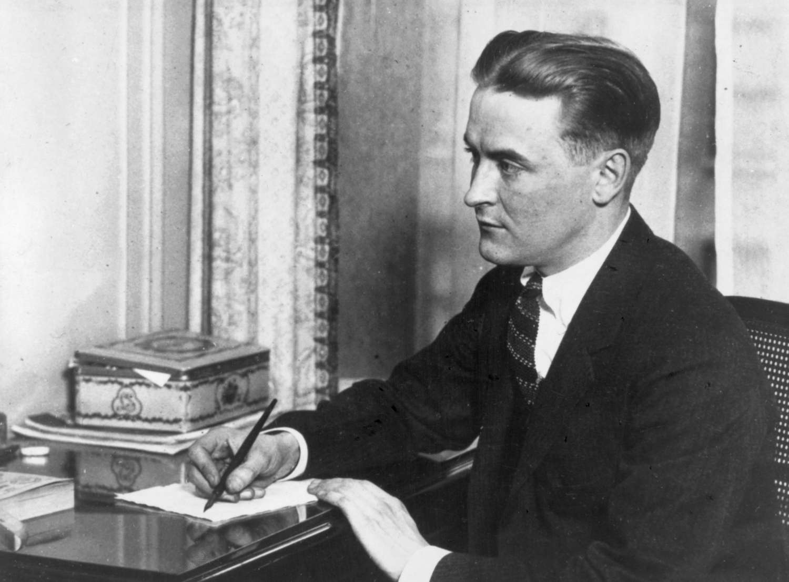

# 📖✨Decoding Fitzgerald 

### Exploring Themes and Emotions in F. Scott Fitzgerald’s Works with NLP

This project applies sentiment analysis and topic modeling to uncover emotional and thematic patterns in three of Fitzgerald’s novels: *This Side of Paradise*, *The Beautiful and Damned*, and *The Great Gatsby*. Combining natural language processing with literary analysis, it reveals how Fitzgerald’s stories evolve emotionally and thematically across chapters, offering a data-driven lens on his literary style.

<p align="center"></p>
<p align="center"><em>F. Scott Fitzgerald, circa 1921 — young, brilliant, and on the cusp of literary immortality</em></p>

## 🧐 Project Overview

### **Sentiment Analysis**

Two models were used to track emotional tone across chapters:

- **VADER**: A rule-based model, fast and reliable for short, informal text. It worked reasonably well for straightforward emotional cues but struggled with more complex or layered prose.

- **Cardiff RoBERTa**: A transformer-based model trained on diverse sentiment-labeled data. It was more sensitive to tone shifts and subtext, capturing emotional nuance especially well in longer, introspective passages.

Together, these models highlighted emotional patterns across chapters, with RoBERTa offering the deeper, more precise reading.

### **Topic Modeling**

Two methods were used to identify dominant themes in each chapter:

- **LDA**: A classic topic modeling approach based on word frequencies. While useful in some contexts, it didn’t perform well here. The topics were vague and repetitive, and struggled to reflect the structure or tone of the novels.

- **BERTopic**: A more modern method that combines transformer-based embeddings with clustering. It produced clearer, more distinctive themes that aligned closely with the narrative flow and emotional shifts in the texts.

BERTopic proved far more effective for analyzing literary themes in Fitzgerald’s work.

### **Visualizations**

Visual plots were created to show how sentiment and themes shift across chapters in each novel, revealing narrative and emotional patterns over time..

## 📦 Dependencies 

This project uses:

- Python 3.10.2
- Jupyter Notebook
- pandas
- matplotlib
- seaborn
- scikit-learn
- nltk
- gensim
- BERTopic
- sentence-transformers

For a full list see `requirements.txt`. 

## 🚀 How to Run the Project

Follow these steps to set up and run the sentiment and topic analysis:

### 1. Clone the Repository

Clone the repository to your local machine:

```bash
git clone https://github.com/herrerovir/Fitzgerald-sentiment-topic-analysis
```

Navigate into the project directory:

```bash
cd Fitzgerald-sentiment-topic-analysis
```

### 2. Install Dependencies

Install all required Python packages:

```bash
pip install -r requirements.txt
```

### 3. Run the Notebooks

Launch Jupyter Notebook:

```bash
jupyter notebook
```

Open and run the notebooks in the following order:

1. **`01-cleaning-fitzgerald-text.ipynb`** – Prepare and clean the text data
2. **`02-sentiment-analysis-fitzgerald.ipynb`** – Perform sentiment analysis
3. **`03-topic-modeling-fitzgerald.ipynb`** – Discover topics in the novels
4. **`04-conclusions.ipynb`** – Visualize sentiment and topic trends across chapters

## 📁 Repository Structure 

```

Decoding-Fitzgerald/
│
├── data/                                       # Raw and cleaned text data from Fitzgerald’s works
│   ├── raw/                                    # Original unprocessed text files
│   └── processed/                              # Preprocessed, cleaned text ready for analysis
│
├── figures/                                    # Visualizations and plots generated by the analysis
│   ├── topic-modeling/                         # Topic modeling related charts and graphs
│   │   ├── bertopic/                           # BERTopic model visual outputs
│   │   └── lda/                                # LDA model visual outputs
│   │
│   └── sentiment-analysis/                     # Sentiment analysis visual outputs
│       ├── vader/                              # VADER model plots
│       └── cardiff-roberta/                    # Cardiff RoBERTa model plots
│
├── notebooks/                                  # Jupyter notebooks and scripts for analysis steps
│   ├── setup_path.py                           # Helper script for setting paths and environment
│   ├── 01-cleaning-fitzgerald-text.ipynb       # Text cleaning and preprocessing
│   ├── 02-sentiment-analysis-fitzgerald.ipynb  # Sentiment analysis process
│   ├── 03-topic-modeling-fitzgerald.ipynb      # Topic modeling workflows
│   └── 04-conclusions.ipynb                    # Final insights and summary
│
├── models/                                     # Saved models and related files
│   ├── cardiff-roberta/                        # Cardiff RoBERTa sentiment model files
│   ├── vader/                                  # VADER sentiment model components
│   ├── bertopic/                               # BERTopic model files and embeddings
│   └── lda/                                    # LDA model files and outputs
│
├── results/                                    # Raw results and processed outputs from analyses
│   ├── topic-modeling/                         # Topic modeling results organized by model
│   │   ├── bertopic/                           # BERTopic model outputs
│   │   │   ├── documents/                      # Topic assignments for documents
│   │   │   ├── topics/                         # Topic descriptions and keywords
│   │   │   └── metrics/                        # Model evaluation metrics
│   │   |
│   │   └── lda/                                # LDA model outputs (same structure as above)
│   │       ├── documents/                      # Topic assignments for documents
│   │       ├── topics/                         # Topic descriptions and keywords
│   │       └── metrics/                        # Model evaluation metrics
│   │
│   └── sentiment-analysis/                     # Sentiment analysis results by model
│       ├── vader/                              # VADER outputs and scores
│       └── cardiff-roberta/                    # Cardiff RoBERTa outputs and scores
│
├── src/                                        # Source code for utilities and core functions
│   └── config.py                               # Configuration files and settings
│       
│
├── requirements.txt                            # Python dependencies and packages needed
└── README.md                                   # Project overview, instructions, and details

```

## 🛠️ Technical Skills & Tools

- NLP preprocessing
- Sentence  tokenization
- Sentiment analysis using transformer and rule-based models
- Topic modeling with BERTopic and LDA
- Data visualization with Matplotlib and Seaborn
- Jupyter workflow & modular code design

## 📚 Dataset

All texts used are from [Project Gutenberg](https://www.gutenberg.org/), in the public domain.

## 📈 Evaluation & Model Comparison

### Sentiment Analysis Comparison

- **VADER**: Good at capturing clear emotional words, but misses nuance.
- **Cardiff RoBERTa**: Captures deeper sentiment shifts in layered prose.

### Topic Modeling Coherence

| Model        | Coherence | Notes                             |
| ------------ | --------- | --------------------------------- |
| **LDA**      | 0.5183    | Repetitive topics, vague clusters |
| **BERTopic** | 0.3595    | More distinct and balanced topics |

Despite LDA’s higher score, BERTopic captured a broader and clearer range of themes, making it better suited for literary interpretation.

## 🤖 Cardiff RoBERTa Model 

*Cardiff RoBERTa* was the stronger of the two sentiment models tested. It’s a transformer-based model trained on large-scale sentiment datasets, including tweets and product reviews, which makes it good at picking up tone, mood, and emotional nuance even when it's subtle or layered.

Compared to VADER, it handled complex sentences and ambiguous emotional cues much more accurately. In Fitzgerald’s prose, where emotion is often implied rather than stated outright, RoBERTa was better at recognizing underlying mood shifts and identifying patterns across longer passages. For this kind of literary text, it offered a deeper and more reliable read.

## 💡 BERTopic Model 

*BERTopic* was the most effective method for topic modeling in this project. It uses BERT embeddings to understand the meaning of text at a deeper level, then applies clustering to group similar content into distinct topics. Unlike traditional models that rely mostly on word frequency, BERTopic captures context, phrasing, and nuance.

It consistently produced clear, interpretable topics that aligned well with each novel’s emotional and narrative structure. Compared to LDA, which struggled with vague or overlapping topics, BERTopic gave a much sharper view of how ideas evolved chapter by chapter—making it the better fit for analyzing literary texts like Fitzgerald’s.

## 📊 Visualizations

All generated charts and plots from the analysis are saved in the `figures/` directory, organized by sentiment model and topic modeling approach. You can open these images to explore how sentiment and themes evolve across Fitzgerald’s novels.

## 🎯 Insights

This analysis uncovered clear and consistent patterns in how Fitzgerald’s novels evolve both emotionally and thematically. Across all three books, sentiment trends move from moments of introspection and romantic hope toward emotional collapse, social conflict, and existential fatigue. These arcs were especially visible in *This Side of Paradise* and *The Beautiful and Damned*, where negative sentiment builds steadily alongside themes like disillusionment, isolation, and financial decline.

The topic modeling revealed a similar structure. Early chapters are often tied to themes like emotional reflection and relationships, while later chapters shift toward crisis, money, and interpersonal strain. BERTopic performed particularly well here, producing topic labels that align closely with narrative turning points and character development.

One of the most interesting outcomes was the interplay between sentiment and topic. Chapters marked by conflict or financial themes almost always carried negative sentiment, while those dealing with introspection or nature tended to remain neutral or slightly positive. In *The Great Gatsby*, this back-and-forth between emotional highs and lows mirrors the novel’s central tension between Gatsby’s idealism and the harsh reality that ultimately undoes him.

Overall, the results support a reading of Fitzgerald as a writer deeply concerned with the costs of ambition, the instability of identity, and the emotional toll of social pressure. Using NLP made it possible to map those patterns in a more structured way, not replacing close reading, but reinforcing and extending what we already know about his work.
